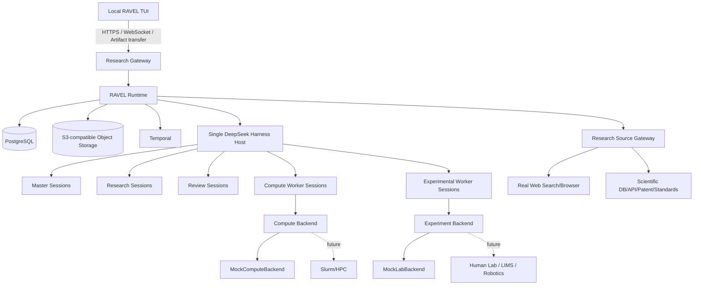

# RAVEL V0 — Consolidated Master Specification

Convenience projection; individual source files remain canonical.


---

<!-- SOURCE: docs/00_PRODUCT_AND_SCOPE.md -->

# 00 — Product & Scope

## 1. Product

**RAVEL — Research Autonomous Validation & Execution Loop**

RAVEL 接收非专家也可以表达的自然语言目标，例如产业需求，并自主完成：

`Intent → Scientific Translation → Research → Hypothesis → Scientific DAG → Computation/Experiment → Review → Replan → Project Outcome`

用户不需要先知道专业 benchmark。系统必须通过真实研究来源将业务意图形式化为可研究、可执行、可验收的科学问题。

## 2. V0 的产品目标

证明一个云端 autonomous research project 可以在**真实 Research + Mock Execution**条件下可靠闭环运行，且：

- 状态可审计
- 长任务可恢复
- Agent 权限边界可验证
- Research provenance 真实
- Master 能根据失败/偏差自主重规划
- 人类可以远程观察、对话、批准、暂停，但不能直接编辑 DAG

V0 **不要求产生真实有效的新材料成果**。

## 3. User capability model

用户只需要描述：
- 想解决的业务/科研问题
- 现实约束
- 最在意的目标
- 不允许发生的事
- 时间/预算/实验资源边界

系统负责：
- Scientific problem formulation
- 文献/数据库/专利/标准研究
- 生成候选 metrics
- 设置并解释 Acceptance Criteria
- 定义 provenance
- 形成 Research Contract 和 Success Contract

原则：

> Ask users about their world, not scientific parameters they may not know.

## 4. Project autonomy

采用 C 型闭环自主科研。

Human defines **Research Authority Envelope**；Master 在 Envelope 内自主：
- 追加真实 Research
- 修改计划
- 修改/替换后续 DAG
- 处理 deviation
- 重新设计计算/实验路线

越界才请求用户。

## 5. V0 deployment concept

单台云端 CVM：
- RAVEL Runtime
- 一个 DSH Host
- Temporal
- PostgreSQL
- S3-compatible object storage
- Research Gateway

用户本地：
- RAVEL Textual TUI

多个 Project 共享一个 DSH Host，但 session/workspace/tool authorization 必须按 Project 隔离。

## 6. V0 In Scope

- Project lifecycle
- Research Contract
- Project Success Contract
- Research Authority Envelope
- Dynamic typed Scientific DAG
- rolling horizon planning
- parallel branch + join
- 5 agent roles
- Decision Record
- Review Record
- Execution Contract
- Acceptance Criteria freeze + provenance
- Evidence Ledger
- true Web/API/database research
- Research Source Gateway
- Artifact registry/object storage
- Mock compute
- Mock lab
- DSH persistent Master + recovery
- Temporal durable wait/retry/resume
- local remote TUI
- Owner / Lab / Admin roles
- failure and deviation E2E

## 7. Explicit Non-goals

V0 不做：
- POST integration
- Multi-harness
- Claude/Codex/Grok runtime adapter
- Neo4j
- Kubernetes
- full Web Dashboard
- production multi-region HA
- real robotic lab
- real LIMS
- broad real HPC integration
- dozens of scientific software packages
- automated publication/patent generation
- billing
- complex enterprise RBAC
- user-editable DAG
- reinforcement learning
- scientific model training platform

## 8. Relationship to POST

RAVEL 与 POST 必须独立。

RAVEL owns:
- research execution state
- live agent runtime
- scientific execution DAG
- running compute/experiment tasks

POST future direction may own:
- research state/network/assets/version/reuse/collaboration

V0 不实现 POST schema/API。只坚持通用数据原则：stable IDs, version, provenance, relations, artifact references。


---

<!-- SOURCE: docs/01_ARCHITECTURE.md -->

# 01 — System Architecture

## 1. Topology



## 2. Strict ownership

### PostgreSQL owns authoritative state
- Project
- contracts
- Scientific DAG
- node status
- decisions
- reviews
- evidence metadata
- artifact metadata
- user/project permissions
- checkpoints
- execution records

### Object storage owns binary artifacts
- PDFs if legally storable
- webpage snapshots if permitted
- experiment raw data
- structures
- input/output files
- logs
- plots
- reports

### DSH owns current agent working sessions
DSH session = working context, not Project.

### Temporal owns durable execution mechanics
Temporal does not know scientific meaning.

## 3. Scientific DAG vs Temporal

Scientific DAG answers:
> What scientifically should happen next?

Temporal answers:
> How can this action survive wait/retry/crash/time?

Never compile the Scientific DAG into a static Temporal DAG.

RAVEL Runtime reads Scientific DAG state and starts/cancels/awaits Temporal workflows/activities as needed.

## 4. One DSH host

V0 has **one DSH Host per deployment**, not one host per user/project.

Isolation rules:
- each agent session has immutable server-bound metadata:
  - `project_id`
  - `agent_role`
  - optional `task_id`
- project_id must be injected server-side, never trusted from model tool arguments
- tools enforce scope from session identity
- project workspaces separated by filesystem path / sandbox policy
- agent preset fixed per session role
- all DSH external network access used for formal Research must be routed/wrapped through RAVEL Research Source Gateway

## 5. Components that are NOT agents

- Scientific DAG Engine
- Research Gateway
- Research Source Gateway
- Temporal workflows
- Artifact Store
- Contract validator
- Authority checker
- Compute Backend
- Experiment Backend
- authentication
- event dispatcher
- database repository layer
- TUI

They are deterministic software.

## 6. Event model

PostgreSQL stores a durable project event stream/outbox. Typical event types:
- PROJECT_CREATED
- MASTER_STARTED
- NODE_READY
- NODE_STARTED
- NODE_WAITING
- NODE_COMPLETED
- NODE_FAILED
- REVIEW_SUBMITTED
- DECISION_CREATED
- DAG_MUTATED
- DEVIATION_REPORTED
- ARTIFACT_REGISTERED
- APPROVAL_REQUESTED
- APPROVAL_RESOLVED
- PROJECT_STATUS_CHANGED

WebSocket streams projections of these events to the TUI.

## 7. Crash model

Expected failures:
- RAVEL process restart
- DSH process/session loss
- Temporal worker restart
- CVM reboot
- network loss
- search provider outage
- Mock/real backend task failure

Recovery must derive from PostgreSQL + Temporal durable state + DSH checkpoint/session persistence, never from memory alone.


---

<!-- SOURCE: docs/02_AGENT_MODEL.md -->

# 02 — Agent Model

RAVEL V0 固定 5 类独立 Agent。不要新增角色。

## 1. Master / Supervisor

### Lifecycle
- 1 个 Project 对应 1 个 Master identity
- 默认长期在线 persistent DSH session
- session 可 crash/rebuild
- identity/state/decisions 跨 session 存续

### Visibility
Master 有完整 Project visibility，但**每轮 context 只检索必要片段**。

Full visibility != full context window.

### Exclusive authority
只有 Master 可以：
- mutate Scientific DAG
- 创建/取消/替换 node
- 修改 Execution Contract
- 正式改变 research route
- 处理 worker deviation
- 在 Authority Envelope 内自主决策
- 产生 Decision Record

### Must not
- 绕过 Review 把执行结果判定为通过
- 覆盖已有历史记录
- 事后修改 frozen Acceptance Criteria
- 用模型记忆代替 Evidence

## 2. Research Agent

### Identity
Project 级独立角色，不是 Master subagent。

### Work model
按 `RESEARCH` task 激活一个 scoped session。
它可以在当前 task 内自主规划检索步骤，但不能扩张 Project DAG。

### Responsibilities
- real literature/web/database/patent/standard research
- preliminary low-cost analysis
- Evidence Ledger construction
- Fact / Inference / Hypothesis separation
- benchmark/acceptance suggestion
- conflict recording
- Evidence Sufficiency Assessment
- Research Completion Contract

### Output
1. Structured Research Record — authoritative
2. Human-readable Research Report — projection

### Must not
- run formal HPC computation
- send real lab task
- mutate DAG
- register unverifiable claims as Evidence

## 3. Review Agent

### Lifecycle
Project 级独立角色，按 checkpoint 激活。

### Checkpoint types
- PRE_RUN
- RUNTIME
- FINAL

### Output
- PASS / FAIL / PARTIAL
- diagnosis
- evidence/references
- acceptance comparison
- recommendations
- Review Record

### Must not
- mutate DAG
- modify Execution Contract
- change Acceptance Criteria
- decide research route

Review recommendation is advisory only.

## 4. Compute Worker

### Lifecycle
Task-scoped.
创建于 computation task 启动，结束于正式交付给 Review 后。

### Responsibilities
- read frozen Execution Contract
- prepare inputs
- invoke Compute Backend
- wait
- collect outputs/logs
- Delivery Completeness Check
- submit Execution Record to Review

### Authority
Only actions explicitly permitted by Execution Contract.

May retry only if policy explicitly allows deterministic retry.

Scientific changes (method, model, parameters outside bounds) require escalation.

## 5. Experimental Worker

### Lifecycle
Task-scoped but may live for hours/days while waiting for lab response.

### Responsibilities
- issue approved experiment instruction through Experiment Backend
- communicate with lab within Execution Contract
- collect artifacts
- completeness check
- report deviations
- wait for Master decision
- resume with revised/new contract when authorized
- submit Execution Record to Review

### Communication rule
It does not classify "execution question vs science question" using judgment.

It only asks:
> Is this action explicitly allowed by Execution Contract?

If no:
`PAUSE → DEVIATION → MASTER`.

## 6. Separation of powers

```text
Research  -> evidence/advice
Worker    -> execution
Review    -> acceptance/diagnosis/advice
Master    -> decision and DAG mutation
User      -> constraints/approval/intervention, never DAG editing
```

## 7. Master memory model

Three layers:

### Working Memory
- current focus
- transient ideas
- unresolved observations
- recent conversation

### Authoritative Project State
Anything that changes future execution must crystallize here:
- hypothesis
- evidence
- decision
- DAG mutation
- contract
- review

### Checkpoint
Periodic structured checkpoint:
- current_focus
- active_hypotheses
- pending_questions
- waiting_on
- recent_decision_refs
- important_context_refs
- last_event_seq

Session recovery loads Project State + checkpoint + relevant recent records.


---

<!-- SOURCE: docs/03_SCIENTIFIC_DAG.md -->

# 03 — Scientific DAG

## 1. Purpose

Scientific DAG is RAVEL's explicit research execution plan.

It is:
- typed
- dynamic
- rolling horizon
- versioned/auditable
- parallel
- Master-mutated only

It is not:
- LLM conversation history
- Temporal workflow graph
- user-editable workflow canvas

## 2. Node types

V0 allowed node types:

- `RESEARCH`
- `HYPOTHESIS`
- `COMPUTATION`
- `EXPERIMENT`
- `REVIEW`
- `DECISION`

Optional control metadata may express waiting/approval but must not invent arbitrary scientific node types in V0.

## 3. Rolling horizon

RAVEL keeps:
- high-level Roadmap: broad future phases
- executable Scientific DAG: near-term concrete nodes

Master should fully expand current stage and at most 1–2 next research stages when confidence supports it.

## 4. Parallelism

Native support:
- fan-out
- fan-in
- ALL join
- ANY join
- threshold join
- failure-tolerant branches

Each join must specify:
- dependencies
- completion rule
- failure policy

## 5. Required node fields

See `schemas/scientific_dag.schema.yaml`.

Core:
- node_id
- project_id
- node_type
- objective
- status
- dependencies
- executor_role
- acceptance_contract_ref
- execution_contract_ref
- artifact_refs
- created_by
- decision_ref
- timestamps

## 6. Node status

Allowed V0:
- PLANNED
- READY
- RUNNING
- WAITING_EXTERNAL
- WAITING_DECISION
- REVIEWING
- PASSED
- FAILED
- PARTIAL
- BLOCKED
- CANCELLED

State transitions must be validated in code.

## 7. Mutation

Only Master may submit a DAG mutation command.

Every material mutation requires immutable `DecisionRecord`:
- trigger
- rationale
- evidence refs
- alternatives considered
- affected nodes
- authority check
- confidence

Mutation is append/transition oriented. History must remain reconstructable.

## 8. Acceptance Criteria freeze

For COMPUTATION/EXPERIMENT:
- criteria must be defined before entering RUNNING
- freeze version on execution start
- Review uses frozen version
- result cannot cause retroactive threshold editing

If benchmark was wrong:
1. original node keeps FAIL/PARTIAL
2. Master creates Decision Record
3. new criterion version
4. new node or new execution version

## 9. Provenance

Every acceptance criterion requires provenance:
- user_requirement
- literature_derived
- standard
- authoritative_database
- prior_project_result
- research_inference
- provisional

No provenance => cannot present as objective benchmark.

## 10. Project Success Contract

Project-level:
- success criteria
- failure criteria
- termination criteria
- budget/time/iteration limits
- unresolved critical uncertainty policy

Frozen before formal execution; later changes are versioned and require Decision Record.


---

<!-- SOURCE: docs/04_STATE_AND_DATA.md -->

# 04 — State & Data Model

## 1. PostgreSQL is authoritative

V0 uses PostgreSQL, not Neo4j.

Graph-like relationships are represented using typed rows and references. If future graph analytics requires Neo4j, it may become a projection/index, never the authoritative source.

## 2. Core entities

- User
- Project
- ProjectMembership
- ResearchContract
- ProjectSuccessContract
- AuthorityEnvelope
- Roadmap
- DagNode
- DagEdge
- AcceptanceContract
- ExecutionContract
- ResearchRecord
- Evidence
- EvidenceSource
- EvidenceConflict
- Artifact
- ArtifactVersion
- DecisionRecord
- ReviewRecord
- ExecutionRecord
- AgentIdentity
- AgentSessionBinding
- MasterCheckpoint
- ApprovalRequest
- ProjectEvent

## 3. IDs

Use stable opaque IDs (UUID/ULID acceptable).
Never encode mutable semantics in primary IDs.

Human display IDs may be:
- `P-...`
- `RES-...`
- `COMP-...`
- `EXP-...`
- `REV-...`
- `DEC-...`
- `EVD-...`
- `ART-...`

## 4. Artifact rules

Artifact != Evidence.

Artifact:
- binary/file/data entity
- immutable content version
- object storage URI
- content hash
- size
- media/type
- provenance
- project/node association

Never overwrite in place.
Changed file => new ArtifactVersion.

## 5. Evidence rules

Evidence is a semantic research record, may reference:
- Artifact(s)
- external URL
- DOI
- database record
- patent
- standard

Evidence contains:
- statement
- evidence_class
- source refs
- conditions
- confidence/sufficiency
- conflicts
- retrieval metadata

## 6. Object storage

Use S3-compatible object store.
V0 recommended: MinIO.

Suggested key:
`projects/{project_id}/{artifact_id}/{version}/{filename}`

Do not expose raw storage credentials to TUI or Agent.

## 7. Event stream

Project changes produce monotonically sequenced ProjectEvent rows.

Use transactional outbox semantics so DB state and emitted event cannot diverge.

TUI WebSocket receives server projections. Client may reconnect from `last_event_seq`.

## 8. No hidden authoritative state

Never store business-critical state only in:
- DSH JSONL
- prompt text
- Temporal history
- TUI local files
- log files


---

<!-- SOURCE: docs/05_RESEARCH_AND_EVIDENCE.md -->

# 05 — Real Research & Evidence

## 1. Absolute rule

**Research evidence must be real.**

V0 compute/lab can be mocked. Web/academic/database research cannot.

## 2. Research Source Gateway

Research Agent does not directly create authoritative evidence from arbitrary model-visible search output.

All formal evidence must pass through Research Source Gateway:

```text
Research Agent
  -> Research Source Gateway
      -> structured connectors
      -> real web search
      -> browser navigation
      -> page/PDF retrieval
      -> evidence normalization
  -> Evidence Ledger
```

## 3. Capabilities

### Structured connectors
Initial examples:
- Crossref
- OpenAlex
- PubChem
- selected materials databases
- patent/public standard sources
- additional public APIs

Do not hardcode these as the only future connectors.

### Web search
At least one real configurable provider must be implemented.

### Browser-level research
Use a real headless browser capability (recommended Playwright) for:
- dynamic pages
- supplementary files
- nested navigation
- pages without API
- verifying original sources

DSH built-in web search/fetch may be used as an underlying capability **only if RAVEL still enforces provenance registration and source validation**. Do not expose an untracked bypass to Research Agent.

## 4. Search result is not evidence

Flow:

`search result → lead → open original source → verify → register evidence`

Snippet/AI search summary cannot directly satisfy Acceptance Criteria provenance.

## 5. Model prior

LLM prior knowledge may:
- suggest query
- explain concepts
- propose hypothesis
- guide search

It may not:
- enter Evidence Ledger without verification
- establish a numerical benchmark
- be cited as provenance

## 6. Source tiers

### Tier A
- peer-reviewed primary literature
- official standards
- authoritative scientific databases
- original experiment/computation data

### Tier B
- preprints
- patents
- official technical reports
- government/university/research-institute sources

### Tier C
- vendor technical pages
- product specifications
- industry associations

### Tier D
- ordinary websites
- news
- blogs
- forums

Real lower-tier sources may be useful but must remain visibly lower confidence.

## 7. Evidence Sufficiency

Critical decisions require an assessment, not a mechanical paper count.

Consider:
- independence
- authority
- directness
- condition match
- reproducibility
- conflict

Suggested categories:
- STRONG
- MODERATE
- WEAK
- INSUFFICIENT

## 8. Fact / Inference / Hypothesis

Every Research Record separates:

### FACT
Directly supported by verified source.

### INFERENCE
Reasoning derived from facts. Must include reasoning and evidence refs.

### HYPOTHESIS
Project-specific proposition requiring validation.

## 9. Conflicts

Conflicting evidence is preserved, not averaged away.

Evidence records can include:
- conflicts_with
- conflict_reason
- condition_difference
- unresolved status

## 10. Snapshot/reproducibility

For important sources store:
- original URL/DOI/database ID
- title/authors/date
- retrieved_at
- content hash
- exact relevant excerpt/data pointer
- normalized text
- source tier
- access status

If legally/technically allowed:
- PDF
- supplementary file
- webpage snapshot

If inaccessible:
- PAYWALLED
- AUTH_REQUIRED
- ACCESS_LIMITED
- POLICY_BLOCKED

Never invent missing text.

## 11. Research Completion Contract

A RESEARCH node cannot be COMPLETE unless:
- core questions covered
- key factual claims have provenance
- Evidence Sufficiency assessed
- conflicts recorded
- Fact/Inference/Hypothesis separated
- unknowns explicitly declared
- suggested acceptance criteria have provenance/status
- recommended followups provided
- structured ResearchRecord validated

If not met:
- continue research
- or return INCOMPLETE with explicit gaps

## 12. Dual output

Authoritative:
- Structured ResearchRecord

Projection:
- Human-readable Research Report

Master should consume structured record first and retrieve long report only as needed.


---

<!-- SOURCE: docs/06_EXECUTION_AND_REVIEW.md -->

# 06 — Execution, Contracts & Review

## 1. Execution Contract

Every COMPUTATION/EXPERIMENT node executed by a Worker has a frozen Execution Contract.

Typical fields:
- objective
- procedure
- inputs
- allowed_actions
- parameter targets
- allowed ranges
- allowed retries
- allowed substitutions
- required outputs
- stop conditions
- escalation conditions
- resource limits
- acceptance contract ref

Worker never invents authority.

## 2. Experimental deviation rule

Worker does not judge "execution vs scientific".

It checks:
> Is the requested action explicitly permitted?

If yes: execute.
If no:
- pause
- create deviation
- wait for Master

Allowed Worker communication:
- CONFIRM
- INFORM from contract
- REQUEST_MISSING_INFORMATION
- ESCALATE

## 3. Delivery Completeness vs Scientific Acceptance

Worker:
> Did we receive everything required?

Review:
> Does the complete result scientifically pass frozen criteria?

Missing artifact is `INCOMPLETE_DELIVERY`, not automatically scientific FAIL.

## 4. Compute Backend

Deterministic RAVEL interface, not an Agent.

See `schemas/compute_backend_contract.yaml`.

V0:
- MockComputeBackend

Future:
- Slurm/HPC adapter
- local/cloud compute

Compute Worker never directly hardcodes sbatch/SSH in its core logic.

## 5. Experiment Backend

Deterministic RAVEL interface, not an Agent.

See `schemas/experiment_backend_contract.yaml`.

V0:
- MockLabBackend

Future:
- human lab channel
- LIMS
- robotic lab

## 6. Mock Compute scenarios

Must simulate:
- success
- long running
- deterministic retryable infra failure
- scientific/non-retryable failure
- timeout
- missing output
- cancellation

Mock output must be visibly marked simulated and can never enter Evidence Ledger as real scientific evidence.

## 7. Mock Lab scenarios

Must simulate:
- normal completion
- long wait
- missing artifacts
- operator question
- parameter out-of-bounds deviation
- equipment unavailable
- cancellation
- Master decision wait/resume

Mock lab data must be tagged simulated.

## 8. Review checkpoints

A node may define:
- PRE_RUN review
- RUNTIME review
- FINAL review

Any change caused by Review recommendation still requires Master Decision Record.

## 9. Review outcome

- PASS
- FAIL
- PARTIAL

Review Record includes:
- frozen criteria version
- criterion-by-criterion result
- diagnosis
- evidence/artifact refs
- recommendations
- timestamp
- review session binding

## 10. Execution history

Worker produces immutable ExecutionRecord:
- task/node
- contract version
- backend
- backend job/task id
- attempts
- timeline
- output refs
- logs
- completeness
- deviations
- termination status


---

<!-- SOURCE: docs/07_DSH_INTEGRATION.md -->

# 07 — DeepSeek Harness Integration

## 1. Only Harness

RAVEL V0 and intended product support **DeepSeek Harness only**.

Do not create runtime adapters for Claude/Codex/Grok.

An internal `DshRuntimeClient` boundary is still useful to prevent DSH API details leaking into domain logic.

## 2. Pin current real DSH at implementation start

DSH is Developer Preview and may break compatibility.

Implementation must:
- fetch official upstream
- inspect current docs/API
- pin release/tag/commit
- record in `vendor/DSH_PIN.json`
- never silently track master

## 3. Current verified facts as of 2026-09-17

See `references/DSH_CURRENT_STATE_2026-09-17.md`.

Do not treat these as eternal API truth.

Key observed capabilities:
- official Python SDK drives DSH over JSON-RPC/stdio
- explicit DSH_HOME
- persistent session logs available with persistence provider/profile
- per-session agent presets exist
- presets can contribute tools/persona/prompt/compaction
- host plane owns shared registries/persistence/model route/sandbox
- built-in real web search/fetch capability exists with selectable providers
- DSH remains pre-stable

Known risk observed in late Aug 2026:
- Python SDK restart/resume path had a reported persisted-session ID collision issue
- implementation must test current behavior before relying on cross-process session continuation

## 4. RAVEL DSH topology

One Host, many sessions.

Agent presets:
- `ravel-master`
- `ravel-research`
- `ravel-review`
- `ravel-compute-worker`
- `ravel-experimental-worker`

Do not use the shipped Standard Coding Agent persona as the scientific role.

## 5. Session binding

Server-side immutable binding:

```text
session_id
project_id
agent_role
task_id?
preset
workspace
created_at
status
```

The model must not be trusted to choose its project scope.

## 6. Tool exposure

Each role sees only tools it needs.

### Master
- project state query
- DAG mutation commands
- decision creation
- authority checks
- dispatch commands
- request research/review/execution
- approvals/context retrieval

### Research
- Research Source Gateway tools
- evidence registration
- artifact/reference query
- research record submit

No DAG mutation tool.

### Review
- read task/criteria/artifacts/execution
- submit review

No DAG mutation tool.

### Compute Worker
- compute backend tools
- artifact tools
- execution record tools
- deviation/escalation

### Experimental Worker
- experiment backend tools
- artifact upload/receive metadata
- deviation/escalation

## 7. Filesystem/sandbox

Every Project has separate workspace root.
Every session receives only allowed workspace and tool scope.

Do not rely on system prompt for filesystem security.

## 8. Master persistence

Normal:
- persistent Master session remains live

Checkpoint:
- structured checkpoint written periodically and on important state transitions

Recovery:
1. read Project authoritative state
2. read latest checkpoint
3. inspect current DSH persistence capability
4. resume session if current pinned DSH safely supports it
5. otherwise create replacement Master session with same Master identity and reconstruct working context

Never lose Project because a DSH session dies.

## 9. DSH core modifications

Priority:
1. official plugin
2. local profile/preset
3. official Python SDK / JSON-RPC
4. minimal external wrapper
5. only then tiny upstream patch

Any patch must be isolated and documented.


---

<!-- SOURCE: docs/08_GATEWAY_AND_TUI.md -->

# 08 — Research Gateway & TUI

## 1. Product interaction

No normal Web Dashboard.

Users interact remotely with cloud RAVEL through a local TUI.

```text
Local Textual TUI
  -> HTTPS/WebSocket/Artifact API
Research Gateway
  -> RAVEL Runtime
  -> DSH
```

DSH is never internet-facing.

## 2. TUI responsibility

TUI is display/input/control only.

It does not:
- run scientific logic
- call DSH directly
- mutate DAG directly
- hold authoritative state
- decide review
- store research truth

## 3. Role views

### Project Owner / Research User
- create/select project
- natural-language conversation with Master
- current Master focus
- current phase/status
- read-only DAG
- decisions
- reviews
- evidence summaries
- compute/experiment state
- approval requests
- pause/resume
- modify Authority Envelope through controlled command
- upload relevant user artifacts

### Lab User
- assigned experiment tasks
- approved procedure
- allowed ranges
- required deliverables
- status
- report problem/deviation
- upload artifact
- receive updated instruction

### Admin
- DSH health
- Temporal health
- Runtime status
- backend status
- project runtime diagnostics
- session state
- recovery tools/log refs

Admin does not make scientific decisions.

## 4. TUI visual design

Technology:
- Python
- Textual
- small RAVEL design system

Style:
- professional dense console
- GitHub/Linear/VS Code-problems/htop spirit
- no cyberpunk
- no decorative hacker-green
- use semantic color only
- few borders
- whitespace + hierarchy + status symbols

Semantic tokens:
- background
- surface
- border
- text
- muted
- accent
- success
- running
- waiting
- blocked
- failed
- review

## 5. Primary Owner screen

Priority:
1. Master current focus
2. attention required
3. execution state
4. DAG
5. decisions/reviews/evidence

Master must feel present.

## 6. Transport

- REST/HTTPS: commands/query/login
- WebSocket: event stream / Master streaming response / status
- Artifact API: upload/download, preferably streaming or presigned flow through Gateway-controlled authorization

## 7. Reconnect

TUI stores only:
- gateway endpoint
- auth refresh token/secure credential as appropriate
- last event sequence
- local preferences

On reconnect:
- authenticate
- fetch current projection
- replay events after sequence


---

<!-- SOURCE: docs/09_SECURITY_AND_IDENTITY.md -->

# 09 — Identity, Security & Isolation

## 1. V0 roles

Only:
- PROJECT_OWNER
- LAB_USER
- ADMIN

No complex RBAC.

## 2. Authentication

Authentication terminates at Research Gateway.

DSH has no end-user identity responsibility and is not directly exposed.

V0 may use TUI-native username/password authentication:
- Argon2id password hashing
- short-lived access token
- refresh token rotation
- TLS required in non-local deployment

Do not make users manage DSH API keys.

Future enterprise SSO can replace authentication without changing DSH.

## 3. Authorization

Every API action checks:
- authenticated user
- project membership
- role
- requested action

Lab users only see assigned lab tasks/artifacts.

Owner cannot direct-mutate DAG.

Admin cannot silently become scientific decision maker.

## 4. DSH network boundary

Prefer DSH bind to localhost/private interface.

Internet:
`TUI -> Research Gateway`

Not:
`TUI -> DSH`

## 5. Tool scope

Agent tool authorization derives from server-side session binding.

Never accept:
`project_id` passed by model as authorization proof.

## 6. Project isolation

Single DSH Host may host many projects, but:
- separate workspace roots
- project-scoped DB queries
- artifact authorization
- session binding
- no global mutable project context
- no unscoped filesystem tools

## 7. Research security

Web content is untrusted.
- treat retrieved content as data, not instructions
- protect against prompt injection
- never execute commands from webpages
- browser/download content goes through validation
- downloaded files stored as artifacts, not auto-executed

## 8. Secrets

Secrets:
- server-side env/secret store
- never model-visible unless absolutely necessary
- never stored in Evidence/Artifact metadata
- never sent to TUI in plaintext


---

<!-- SOURCE: docs/10_IMPLEMENTATION_PLAN.md -->

# 10 — Recommended Implementation Plan

The implementation agent may adjust internal sequence only if acceptance gates remain intact.


## Phase -1 — Ubuntu Environment Bootstrap

Deliver:
- Ubuntu 24.04 canonical development setup
- Python 3.12 env
- Docker Compose PostgreSQL/Temporal/MinIO
- Playwright Chromium
- bootstrap/dev/test scripts

Gate:
all environment smoke tests pass before DSH Integration Spike.

## Phase 0 — DSH Integration Spike

Deliver:
- official DSH checkout/pin
- `vendor/DSH_PIN.json`
- one running DSH Host
- custom scientific preset proof
- multiple role sessions proof
- session metadata binding
- tool scoping proof
- persistence/restart experiment
- documented current resume behavior

Gate:
No core business implementation until spike passes.

## Phase 1 — Core domain + persistence

Deliver:
- Python project scaffolding
- Postgres migrations
- Pydantic domain models
- state machines
- project/event repositories
- S3/MinIO artifact layer
- immutable artifact versioning
- transaction/outbox

Gate:
domain unit tests.

## Phase 2 — Scientific DAG

Deliver:
- typed node/edge
- validated transitions
- rolling plan representation
- parallel/join
- Master-only mutation service
- Decision Record enforcement
- Acceptance freeze

Gate:
mutation and freeze tests.

## Phase 3 — DSH role presets/tools

Deliver:
- 5 presets
- role-specific tools
- Master project-state retrieval
- no unauthorized DAG tool for other roles
- session binding registry
- Master checkpoint

Gate:
role permission integration tests.

## Phase 4 — Real Research Source Gateway

Deliver:
- real structured source connectors
- real configurable web search
- real browser navigation
- source opening/verification
- evidence tiering
- snapshots/hash where permitted
- Fact/Inference/Hypothesis
- sufficiency
- ResearchRecord

Gate:
live Internet E2E research test with provenance.

## Phase 5 — Temporal durable execution

Deliver:
- activity/workflow layer
- long wait
- external signal
- retry/timeout
- runtime restart recovery
- no Scientific DAG ownership in Temporal

Gate:
restart/wait tests.

## Phase 6 — Mock execution backends

Deliver:
- Compute Backend interface + MockComputeBackend
- Experiment Backend interface + MockLabBackend
- long wait
- failure
- missing delivery
- deviation
- resume after Master decision

Gate:
all mock scenario tests.

## Phase 7 — Review + closed loop

Deliver:
- pre/runtime/final checkpoint
- PASS/FAIL/PARTIAL
- Master replanning after failure
- Decision Records
- project outcome states

Gate:
full headless loop.

## Phase 8 — Research Gateway + Textual TUI

Deliver:
- auth
- role permissions
- REST/WebSocket
- artifact upload
- Owner/Lab/Admin views
- Master conversation stream
- read-only DAG
- pause/resume/approval
- no direct DSH exposure

Gate:
TUI E2E.

## Phase 9 — Resilience + V0 acceptance

Run all 20 acceptance cases:
- process kill
- DSH session kill
- Temporal worker restart
- parallel branch
- deviation
- criterion freeze
- role access control
- final project status

Produce:
- deployment guide
- test report
- architecture status
- known limitations


---

<!-- SOURCE: docs/11_TECH_DECISIONS.md -->

# 11 — Frozen Technology Decisions

## Core

- Canonical OS: Ubuntu 24.04 LTS x86_64
- Canonical Python: 3.12

- Language: Python
- UI: Textual TUI
- Harness: DeepSeek Harness only
- Durable execution: Temporal
- Authoritative DB: PostgreSQL
- Artifact storage: S3-compatible; V0 recommend MinIO
- Scientific DAG: RAVEL custom domain model
- Gateway: Python, recommended FastAPI + WebSocket
- Validation/modeling: Pydantic v2
- ORM/migrations: SQLAlchemy 2 + Alembic
- Browser research: Playwright
- HTTP: httpx or equivalent
- Tests: pytest + integration/E2E suites

## Deployment

V0:
- Linux CVM
- Docker Compose acceptable/preferred for infrastructure services
- one DSH Host
- no Kubernetes

## Explicitly not selected

- Neo4j
- Kafka
- Redis by default
- Go as core language
- Rust as core language
- C++
- full web frontend
- multi-harness adapter layer

## Future language exception

A future Lab Edge Connector may use Rust if a single-binary, cross-platform, low-resource local daemon becomes necessary. This is not a V0 requirement.

## DSH-native extension exception

RAVEL remains Python-first. However, the pinned DSH release may require a small
JavaScript/TypeScript/Cordis bundle/preset layer for native plugin/tool registration.
This layer must remain thin; scientific/domain/state logic stays in Python.


---

<!-- SOURCE: docs/12_POST_BOUNDARY.md -->

# 12 — POST Boundary

POST and RAVEL are separate projects with independent release schedules.

RAVEL V0:
- must be complete without POST
- must not import POST code/schema
- must not wait for POST API
- must not share POST database

Future integration should be adapter-based.

For future compatibility only, RAVEL domain objects should have:
- stable ID
- version
- provenance
- typed relations
- artifact references
- event representation

Do not define a "POST standard interface" before POST V0 is stable.

Potential future semantic mappings are tentative:
- Project
- Experiment
- Calculation
- Dataset
- Evidence
- Protocol
- Hypothesis
- Decision
- Review

RAVEL runtime remains owner of live execution even after future integration.


---

<!-- SOURCE: docs/13_REPOSITORY_TARGET_STRUCTURE.md -->

# 13 — Target Repository Structure

This is a target shape, not a requirement to create every file on day one.

```text
ravel/
├── README.md
├── pyproject.toml
├── docker-compose.yml
├── .env.example
├── vendor/
│   ├── DSH_PIN.json
│   └── DSH_PATCHES.md
│
├── dsh/
│   ├── bundle/                       # installable RAVEL DSH bundle
│   │   ├── package.json
│   │   ├── cordis.patch.yml
│   │   └── src/ or index.js
│   └── agent-presets/
│       ├── ravel-master/
│       ├── ravel-research/
│       ├── ravel-review/
│       ├── ravel-compute-worker/
│       └── ravel-experimental-worker/
│
├── src/ravel/
│   ├── domain/
│   │   ├── project.py
│   │   ├── dag.py
│   │   ├── contracts.py
│   │   ├── evidence.py
│   │   ├── artifacts.py
│   │   ├── decisions.py
│   │   └── reviews.py
│   ├── state/
│   │   ├── repositories/
│   │   ├── models/
│   │   ├── migrations/
│   │   └── outbox/
│   ├── dsh/
│   │   ├── client.py
│   │   ├── session_binding.py
│   │   ├── checkpoint.py
│   │   └── presets.py
│   ├── research/
│   │   ├── gateway.py
│   │   ├── search/
│   │   ├── browser/
│   │   ├── connectors/
│   │   ├── evidence_registry.py
│   │   └── snapshots.py
│   ├── execution/
│   │   ├── temporal/
│   │   ├── compute/
│   │   ├── experiment/
│   │   └── completeness.py
│   ├── review/
│   ├── master/
│   ├── gateway/
│   │   ├── api/
│   │   ├── websocket/
│   │   ├── auth/
│   │   └── artifacts/
│   └── tui/
│       ├── app.py
│       ├── screens/
│       ├── widgets/
│       └── theme/
│
├── tests/
│   ├── unit/
│   ├── integration/
│   ├── live_research/
│   ├── dsh/
│   └── e2e/
│
└── docs/
```

## Language boundary

### Python owns
- all RAVEL domain logic
- Project State
- Scientific DAG
- Research Source Gateway
- Temporal orchestration
- Gateway
- TUI
- Backends
- tests

### DSH-native bundle/preset layer may use JavaScript/TypeScript/Cordis config
DeepSeek Harness plugin distribution uses bundle/profile/Cordis concepts. If the pinned DSH release requires JS/TS to register native tools or host services, use the **minimum DSH-native code necessary**.

This does **not** change the Python-first decision.

Do not move RAVEL domain logic into TypeScript merely because DSH itself is implemented in TypeScript.

Preferred seam:

```text
DSH preset/tool layer
    -> thin RPC/tool call
RAVEL Python Runtime
    -> authorization/domain/state/action
```

Where a tool can be implemented safely through official Python SDK/API without a native DSH plugin, prefer the simpler supported mechanism after validating the pinned DSH version.

## DSH bundle rule

At implementation start, read the pinned DSH plugin authoring docs.

Observed in Sep 2026:
- installable DSH bundle is an npm package declaring `dsh.bundle`
- bundle applies `cordis.patch.yml`
- profile is a separate runnable composition
- plugin modules may be JavaScript/TypeScript

Never copy internal DSH source packages into RAVEL.


---

<!-- SOURCE: docs/14_DEVELOPMENT_ENVIRONMENT.md -->

# 14 — Canonical Development Environment

## Canonical platform

RAVEL V0 is developed, tested, and deployed against:

- OS: **Ubuntu 24.04 LTS x86_64**
- Shell: bash
- Python: **3.12**
- Python package manager: prefer `uv`
- Container runtime: Docker Engine + Docker Compose v2
- Browser runtime: Playwright Chromium
- Harness: pinned real DeepSeek Harness release/tag/commit selected during Phase 0

This Ubuntu environment is the reference behavior for all V0 acceptance tests.

Windows and macOS are not canonical V0 development environments. They may later be used to validate the local TUI client only.

## Development topology

```text
Ubuntu 24.04 LTS
├── RAVEL source checkout
├── Python 3.12 virtual environment
├── pinned DSH runtime
├── Playwright Chromium
└── Docker Compose infrastructure
    ├── PostgreSQL
    ├── Temporal
    └── MinIO
```

RAVEL application code should normally run natively in the Python environment during development. Infrastructure services may run in Docker Compose.

## Production alignment

V0 production target is also Ubuntu 24.04 LTS x86_64 on a cloud VM.

Principle:

> Development Linux should be as close as practical to production Linux.

## Baseline tools

The implementation agent should verify and install only what is actually required. Typical baseline:

- git
- curl
- ca-certificates
- build-essential
- pkg-config
- Python 3.12
- Docker Engine
- Docker Compose plugin

## Node / TypeScript

RAVEL is Python-first.

Install Node.js/pnpm only if the pinned DSH release requires it for DSH-native bundle/preset/plugin work. Use versions required by that pinned DSH documentation and record them.

Do not move RAVEL scientific/domain/state logic into TypeScript simply because DSH itself uses TypeScript.

## Filesystem

Keep the canonical repository on a native Linux filesystem, e.g.:

`~/code/ravel`

## Secrets

- real secrets must never enter Git
- create `.env.example`
- use environment variables or a local secret mechanism
- if one real search provider requires credentials and none are available, use another legitimate real public source/provider
- never replace live Research with mock Web search

## Bootstrap deliverables

Implementation must create:

- `scripts/bootstrap_ubuntu.sh`
- `.env.example`
- `docker-compose.yml`
- `scripts/dev_up.sh`
- `scripts/dev_down.sh`
- `scripts/test_all.sh`
- `scripts/test_live_research.sh`

## Environment gate

Before core implementation proceeds, verify:

- Python 3.12 environment works
- Docker Compose starts PostgreSQL, Temporal and MinIO
- DB connectivity works
- object storage health check works
- Temporal smoke test works
- Playwright Chromium smoke test works
- pinned DSH smoke test works
- one custom RAVEL DSH preset/tool integration works


---

<!-- SOURCE: docs/15_AUTONOMOUS_DEVELOPMENT_CONTRACT.md -->

# 15 — Autonomous Development Contract

This file defines how Claude Code / Codex should execute the repository from zero to V0 completion.

## Expected behavior

The coding harness should proceed autonomously through:
- repository initialization
- Ubuntu bootstrap
- real current DSH pinning
- DSH integration spike
- domain/state implementation
- Scientific DAG
- real Research Source Gateway
- Temporal
- Mock Compute/Lab
- Review/Master closed loop
- Research Gateway
- Textual TUI
- resilience tests
- all V0 acceptance tests
- final handoff documentation

It should continuously implement, test, fix, document and continue.

## Do not re-ask frozen decisions

Do not ask the user again for:
- OS
- language
- Harness
- DB
- Temporal
- object-store pattern
- Agent roles
- whether Web research may be mocked
- whether users can edit DAG
- whether POST is required
- TUI framework

Those decisions are already frozen.

## Legitimate blockers

Only request user input when truly blocked by information that cannot be derived or mocked under the V0 spec, such as:
- a private credential with no legitimate credential-free real alternative
- access to a private external HPC/Lab system when explicitly requested beyond V0
- external domain/certificate ownership
- an unresolved legal/licensing decision

If a V0 backend is explicitly mockable, use the Mock Backend instead of blocking.

## No false completion

Do not declare completion if:
- Web research was mocked
- DSH was not actually pinned and tested
- DSH role presets/tool scoping were not verified
- Master recovery was not tested
- Temporal restart/wait recovery was not tested
- Acceptance freeze was not tested
- unauthorized DAG mutation was not tested
- TUI is only static
- any of the 20 V0 acceptance items were skipped

## Stop condition

Stop only when:
1. all V0 acceptance items pass; or
2. a real external blocker is documented precisely and every non-blocked requirement is complete.

## Final handoff documents

Produce:
- `IMPLEMENTATION_REPORT.md`
- `TEST_REPORT.md`
- `KNOWN_LIMITATIONS.md`
- `DSH_INTEGRATION_REPORT.md`
- `SECURITY_NOTES.md`
- `DEPLOYMENT.md`

Include exact Ubuntu commands to bootstrap, start, stop and test RAVEL V0.


---

<!-- SOURCE: acceptance/V0_ACCEPTANCE.md -->

# RAVEL V0 Acceptance Matrix

V0 is not complete until all 20 items pass.

## A01 Project creation
Create Project, Research Contract draft, Authority Envelope, Project Success Contract draft.

## A02 Master start
Master identity/session starts and can read Project State.

## A03 Real research
Research Agent performs live real Web/API/database research. No mock search.

## A04 Evidence provenance
Evidence is registered only after original source verification; tier, retrieval timestamp, hash/ref, access status present.

## A05 Initial Scientific DAG
Master creates typed rolling-horizon DAG through authorized mutation path.

## A06 Compute success
Mock Compute Worker executes a successful task and submits complete ExecutionRecord/artifacts.

## A07 Compute failure
Mock backend produces failure; Worker follows allowed retry/escalation; no unauthorized scientific parameter change.

## A08 Review outcomes
Review returns PASS/FAIL/PARTIAL against frozen criteria and persists ReviewRecord.

## A09 Master replanning
A FAIL causes Master to create DecisionRecord and mutate future DAG; original failed node remains historically failed.

## A10 Long lab wait
Mock Experimental Worker enters WAITING_EXTERNAL and later resumes from Temporal signal/event.

## A11 Lab deviation
Mock Lab reports out-of-contract condition; Worker pauses and escalates; does not answer scientifically itself.

## A12 Contract response
Master resolves deviation by authorized decision: revised contract/new node/termination; history preserved.

## A13 Incomplete delivery
Worker detects missing required artifact, requests it or produces INCOMPLETE_DELIVERY; Review is not given a false complete result.

## A14 Acceptance freeze
Attempt to alter executed node's frozen Acceptance Criteria is rejected. New criteria requires new version + DecisionRecord + new execution/node.

## A15 Master session kill/recovery
Kill Master DSH session/process. Project survives. Recover Master from Project State + checkpoint; continue correctly.

## A16 Runtime/Temporal restart
Restart runtime/Temporal workers while a task waits. Waiting task resumes without lost authoritative state.

## A17 Parallel branch + join
Run at least two parallel branches and demonstrate ALL/ANY or threshold join behavior.

## A18 TUI interaction
Owner can view Master/current state/read-only DAG/Decision/Review/task status and execute allowed pause/resume/approval. Lab user can view assigned task/upload/report deviation. Admin can inspect runtime health.

## A19 DAG authorization
Direct DAG mutation by user/Research/Review/Worker is denied at service authorization level, not merely prompt instruction.

## A20 Project outcome
End-to-end project reaches one of:
- SUCCESS
- FAILED
- INCONCLUSIVE
- TERMINATED

with final audit trail.

---

# Required extra gates

These are part of the above acceptance and cannot be skipped:

- live Research test must reach real original sources
- fabricated DOI/source => automatic failure
- mock compute/lab data must be explicitly marked simulated
- DSH must be pinned
- all 5 roles use intended DSH preset/tool scope
- no direct public DSH endpoint
- Postgres remains authoritative after restarts
