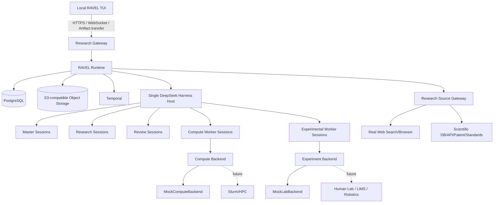

# 01 — System Architecture

## 1. Topology



## 2. Strict ownership

### PostgreSQL owns authoritative state
- Project
- contracts
- Scientific DAG
- node status
- decisions
- reviews
- evidence metadata
- artifact metadata
- user/project permissions
- checkpoints
- execution records

### Object storage owns binary artifacts
- PDFs if legally storable
- webpage snapshots if permitted
- experiment raw data
- structures
- input/output files
- logs
- plots
- reports

### DSH owns current agent working sessions
DSH session = working context, not Project.

### Temporal owns durable execution mechanics
Temporal does not know scientific meaning.

## 3. Scientific DAG vs Temporal

Scientific DAG answers:
> What scientifically should happen next?

Temporal answers:
> How can this action survive wait/retry/crash/time?

Never compile the Scientific DAG into a static Temporal DAG.

RAVEL Runtime reads Scientific DAG state and starts/cancels/awaits Temporal workflows/activities as needed.

## 4. One DSH host

V0 has **one DSH Host per deployment**, not one host per user/project.

Isolation rules:
- each agent session has immutable server-bound metadata:
  - `project_id`
  - `agent_role`
  - optional `task_id`
- project_id must be injected server-side, never trusted from model tool arguments
- tools enforce scope from session identity
- project workspaces separated by filesystem path / sandbox policy
- agent preset fixed per session role
- all DSH external network access used for formal Research must be routed/wrapped through RAVEL Research Source Gateway

## 5. Components that are NOT agents

- Scientific DAG Engine
- Research Gateway
- Research Source Gateway
- Temporal workflows
- Artifact Store
- Contract validator
- Authority checker
- Compute Backend
- Experiment Backend
- Project Supervisor
- authentication
- event dispatcher
- database repository layer
- TUI

They are deterministic software.

### Control plane and data plane

Phase 10 splits the runtime in two, and the split is the answer to "who drives a
project when nobody is at a keyboard":

```text
Control plane   ProjectSupervisor (src/ravel/execution/supervisor.py)
                发现 active project、给每个 project 一个 ProjectLoop、reap 结束的 loop。
                它读 PostgreSQL 决定做什么，不决定科研问题，也不执行任何 node 的工作。
                scripts/run_v0.sh 启动它；TUI 不是它。

Data plane      ProjectLoop + 五类 Agent + Temporal + Backend
                一个 node 的工作在这里发生：Worker Agent 在席位上说和问，
                Temporal 保证 durable execution，Backend 真正干活（V0 是 mock）。
```

Supervisor 不持有科研权威，也不持有 worker 的权威：它只做“把仍然活跃的 project
交给一个 loop”这一件事，loop 自己去问 DAG、问 contract、问 review。所以 supervisor
挂掉不会丢失 project（重启后从 PostgreSQL 重新发现），而 loop 挂掉只影响那一个
project——这是 P10-12 与 P10-10/P10-11 的差别。

Loop 的数量与 project 的数量相同，而不是与 session 的数量相同：一个 project 的五个
席位由同一个 loop 依次 dispatch，每个席位在自己的 `(project, role)` scope 里起 session。

## 6. Event model

PostgreSQL stores a durable project event stream/outbox. Typical event types:
- PROJECT_CREATED
- MASTER_STARTED
- NODE_READY
- NODE_STARTED
- NODE_WAITING
- NODE_COMPLETED
- NODE_FAILED
- REVIEW_SUBMITTED
- DECISION_CREATED
- DAG_MUTATED
- DEVIATION_REPORTED
- ARTIFACT_REGISTERED
- APPROVAL_REQUESTED
- APPROVAL_RESOLVED
- PROJECT_STATUS_CHANGED

WebSocket streams projections of these events to the TUI.

## 7. Crash model

Expected failures:
- RAVEL process restart
- DSH process/session loss
- Temporal worker restart
- CVM reboot
- network loss
- search provider outage
- Mock/real backend task failure

Recovery must derive from PostgreSQL + Temporal durable state + DSH checkpoint/session persistence, never from memory alone.
